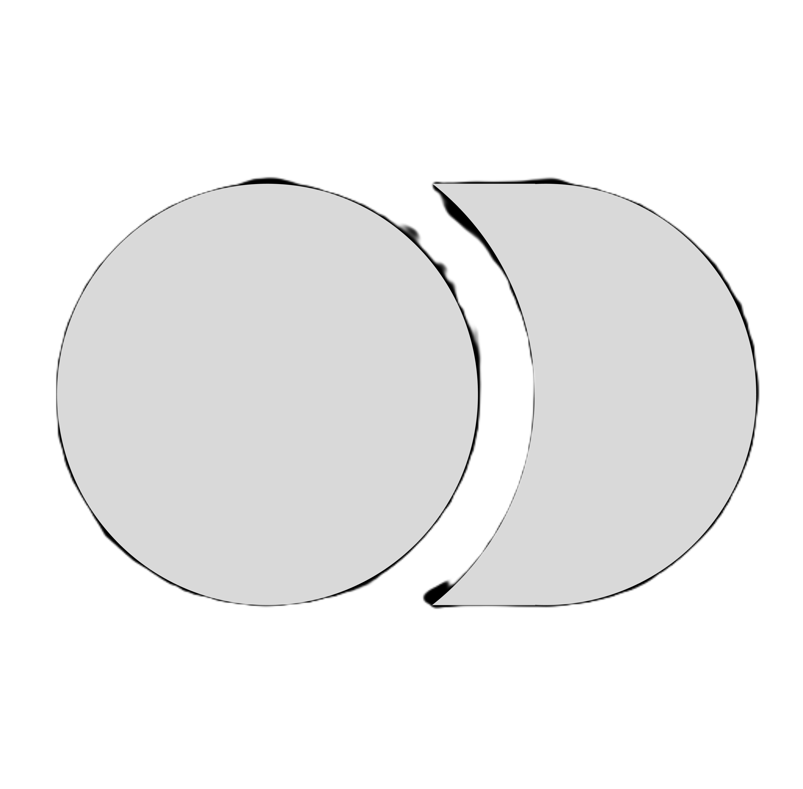
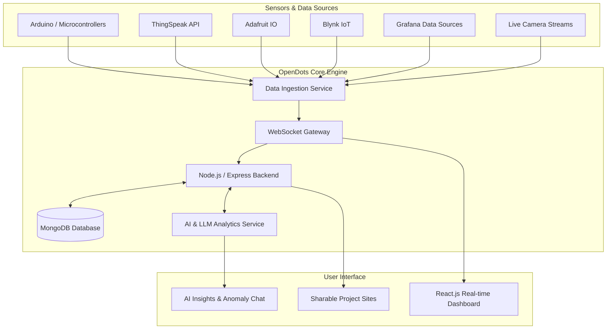

# OpenDots 

###### AI • IoT • Data Analytics Platform


  
  
  
  
  
  
  
  
  
  
  
  
  <a href="https://multiverseweb.github.io/OpenDots/">
</a>

---

OpenDots is an open-source, integrated IoT data visualization and insight platform that helps users turn raw sensor data into meaningful, real-time visuals and AI-powered insights. It is designed to be hardware-agnostic, data-first, and easy to extend for contributors.

## Preview


## Overview

OpenDots allows users to collect, visualize, and analyze live data from multiple IoT sources in one unified platform. Instead of building separate systems for data ingestion, dashboards, and analysis, OpenDots combines everything into a single workflow.

Users can create highly customizable dashboards, publish sharable project sites, monitor live data streams, and interact with their data using AI-based insights.

## Key Features

- Highly customizable dashboards with flexible layouts and visualizations  
- Live data logs and real-time visualizations using WebSockets  
- Sharable public project websites for collaboration and showcase  
- Support for Arduino-based systems and popular IoT platforms  
- Integration with ThingSpeak, Adafruit IO, Blynk, and Grafana  
- Support for live camera feeds and video streams  
- Chat-based AI insights for trends, summaries, and anomaly detection  

## System Architecture



## Tech Stack

| Layer | Technologies |
|------|-------------|
| Frontend | HTML, CSS, JavaScript, React.js |
| Backend | Node.js, Express.js |
| Database | MongoDB |
| Real-time Communication | WebSockets |
| IoT & Data Sources | Arduino, ThingSpeak, Adafruit IO, Blynk, Grafana |
| AI & Analytics | Python, AI/LLM integration |
| Authentication | Firebase Authentication, JWT |
| DevOps & CI/CD | GitHub, GitHub Actions |
| Deployment | Vercel, Netlify, Cloud hosting |

## Installation & Getting Started

### Prerequisites
- [Node.js](https://nodejs.org/) (v16.0 or higher)
- [npm](https://www.npmjs.com/) or [yarn](https://yarnpkg.com/)
- [MongoDB](https://www.mongodb.com/) instance (local or MongoDB Atlas)

### 1. Clone the Repository
```bash
git clone https://github.com/multiverseweb/OpenDots.git
cd OpenDots
```

### 2. Install Dependencies
```bash
npm install
```

### 3. Environment Configuration
Create a `.env` file in the root directory:
```env
PORT=5000
MONGODB_URI=mongodb://localhost:27017/opendots
JWT_SECRET=your_jwt_secret_key
FIREBASE_API_KEY=your_firebase_api_key
```

### 4. Launch Application
```bash
# Start backend server & frontend dev environment
npm run dev
```
Open `http://localhost:3000` in your browser.

### 5. Connecting IoT Telemetry
- Configure sensor nodes to push WebSocket payloads to `ws://localhost:5000/api/v1/stream`.
- Enter your ThingSpeak / Adafruit IO credentials in the dashboard integrations panel to auto-sync channels.

## Use Cases

- Student and academic IoT projects  
- Environmental and community monitoring  
- Research data visualization  
- Smart systems dashboards  
- Social-impact and open-data projects


### Star History

<picture>
  <source
    media="(prefers-color-scheme: dark)"
    srcset="
      https://api.star-history.com/svg?repos=multiverseweb/OpenDots&type=Date&theme=dark
    "
  />
  
  <source
    media="(prefers-color-scheme: light)"
    srcset="
      https://api.star-history.com/svg?repos=multiverseweb/OpenDots&type=Date
    "
  />
  
</picture>

---

### Our Valuable Contributors ❤️

[](https://github.com/multiverseweb/OpenDots/graphs/contributors)

### Stargazers ⭐

<div align='left'>

[](https://github.com/multiverseweb/OpenDots/stargazers)

</div>

### Forkers 🍴

[](https://github.com/multiverseweb/OpenDots/network/members)


## Maintainer

[Tejas Gupta](https://www.tejasgupta.work)
